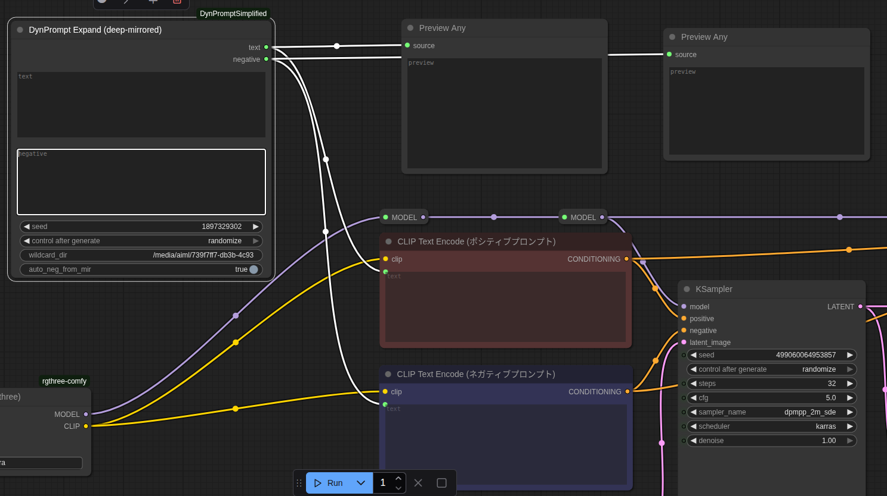
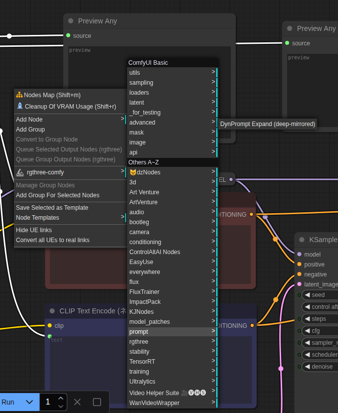

# ComfyUI Dynamic Prompting Simplified

A minimal **dynamic prompting + mirrored wildcards** node for ComfyUI.

## Features
- `{a|b|{c|d}}` nested choice expansion (deterministic by seed).
- `__name__` loads `wildcards/name.txt`.
- `__name-mir__` strictly loads `wildcards/name-mir.txt`.
- In **negative** phase, if `__name__` is used and `name-mir.txt` exists, it auto-mirrors to **all options except the chosen one**.
- Deterministic selection per seed.

## Install
1. Copy this folder to: `<ComfyUI>/custom_nodes/ComfyUI-DynPromptSimplified`
2. (Optional) Put your wildcard files in `ComfyUI-DynPromptSimplified/wildcards/` or set `wildcard_dir` to any folder.
3. Restart ComfyUI.

## Node
**DynPrompt Expand (mirrored wildcards)**
- Inputs: `text`, `negative`, `seed`, `wildcard_dir`, `auto_neg_from_mir`
- Outputs: expanded `text`, expanded `negative`

## Node Inputs
- positive: positive prompt
- negative: negative prompt
- Seed: this is used to determine how the node will select tags
- allow neg from mir: automatically adds -mir tags to negative prompt without explicitly needing to add it to the negative prompt
<br>
Wire the outputs into your usual `CLIP Text Encode` node <br>
You can preview what the output is with the "preview any" node in utils
<br>

<br>
## ✨ Features

- **Nested choices** with `{option1|option2|{nested1|nested2}}`
- **Wildcard expansion** with `__name__` → expands from `wildcards/name.txt`
- **Line-separated wildcard files** that may themselves contain braces and wildcards
- **Mirrored wildcards** with `__name-mir__`:
  - Positive prompt gets the **chosen option**
  - Negative prompt gets **all the other options, comma-separated**
  - Strict resolution: `__name-mir__` reads **only** `wildcards/name-mir.txt` (no fallback to `name.txt`)
- **Deterministic behavior** using the current generation seed
- Works for both **positive** and **negative** prompts
- Expanded prompts are saved into PNG metadata

  ## 📑 Wildcard Files

- Located in the `wildcards/` directory (configurable).
- Each line is one possible expansion.
- Lines may contain further braces `{}` and wildcard calls.

**Example: `wildcards/hats.txt`**
```
{red hat|blue hat|{green hat|yellow hat|{black hat|gold hat}}}
beret
top hat
```

## 🔄 Mirrored Wildcards

- File name: `name-mir.txt` (called via `__name-mir__`).
- Ensures complementary picks between positive/negative prompts.

**Example: `wildcards/hats-mir.txt`**
```
{red hat|blue hat|green hat}
{tall hat|short hat|medium hat}
```

- Positive prompt: `portrait, __hats-mir__`
- Negative prompt: `lowres, __hats-mir__`
  - If pos → `red hat`, neg → `blue hat, green hat`
  - If pos → `short hat`, neg → `tall hat, medium hat`

This ensures that the **negative prompt excludes the token chosen in the positive prompt.**

### 🧩 Nested `-mir` behavior (auto-discovery)

Mirrored tokens can be **nested inside other wildcards**. If a wildcard you use in the **positive** prompt expands to another token like `__foo-mir__`, the extension can **automatically inject the mirrored complement** into the **negative** prompt (so you don’t have to add `__foo-mir__` manually).

- This requires the checkbox in the UI:  
  **“Automatically mirror -mir wildcards without explicitly adding them to the negative prompt.”** (enabled by default)
- The auto-inject only happens if the negative prompt does **not** already contain that `__*-mir__` token.
- Resolution is strict: `__foo-mir__` reads `wildcards/foo-mir.txt` only.

**Example (nested):**
```
wildcards/outfits.txt
---------------------
__hats-mir__, {casual|formal}

wildcards/hats-mir.txt
----------------------
{red hat|blue hat|green hat}
```

Usage:
- Positive: `portrait, __outfits__`
- Negative: *(leave blank or put your usual negatives)*
<br>
- add node from: add node -> prompt -> DSynPrompt Expand (deep-mirrored)
<br>

<br>

Behavior:
- The positive prompt expands `__outfits__` → which contains `__hats-mir__`.
- With the checkbox enabled, the extension auto-injects `__hats-mir__` into the **negative** and expands it there as the comma‑separated “other” options.
- If the seed picks **`red hat`** for positive, the negative gets **`blue hat, green hat`** automatically.

## ⚙️ Usage

- Write prompts as usual with `{}` and `__wildcards__`.
- Wildcards are recursively expanded.
- Mirrored wildcards respect complement logic.

**Prompt Example:**
```
Positive: portrait, {cinematic|studio|outdoor}, __hats__, soft lighting
Negative: lowres, bad anatomy, __hats-mir__
```

## Notes
- Missing wildcard files resolve to empty strings.
- Choice/wildcard expansion is capped to prevent runaway recursion.
- If `negative` is blank and `auto_neg_from_mir` is ON, the node scans the positive for `__tokens__`
  and auto-builds a mirrored negative when possible.

License: GPLv3 (same as the original)
